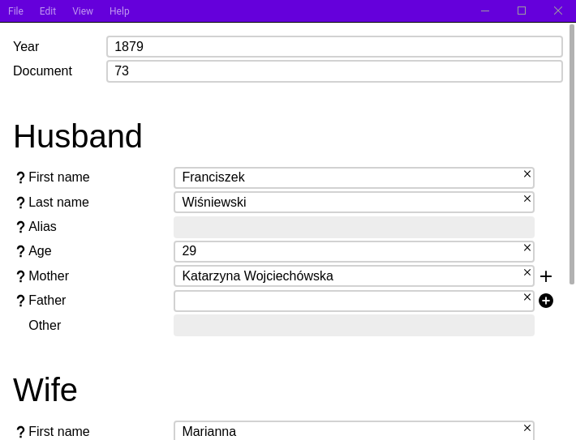
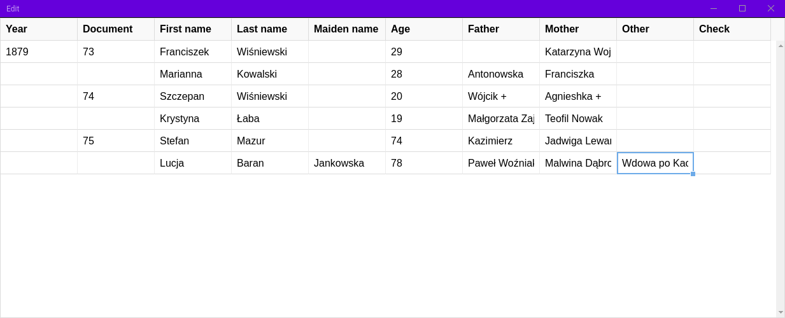

# Indexer

Small application to simplify work for [Poznań project](http://poznan-project.psnc.pl/) collaborators. Built with [Electron](https://www.electronjs.org/) and [React](https://ru.reactjs.org/).

## Technologies

This application is written entirely in JavaScript (tested and works on NodeJS versions 10 to 14). It uses Electron 5.0.6 and React ^16.8.6

## Features

- Easy import and export to excel table
- Simple interface for filling necessary data for Poznań project
- Editable fields order
- All annotations that may be needed for different fields with keyboard shortcuts



- Translations in English, Russian, Polish and French
- Night mode
- Editable table preview with undo and redo history



## Building

Make sure to install all the necessary dependencies after cloning using

```bash
$ npm install
```

When the installation process is finished, run one of the following commands to build application for appropriate operating system

```bash
# Windows
$ npm run build:win
# Linux
$ npm run build:lin
# Mac
$ npm run build:max
```

## Local development

Run application server locally with

```
$ npm run electron-dev
```

Note that the application uses port 3000 in development mode, so it needs to be free. Developer tools will be opened automatically.
